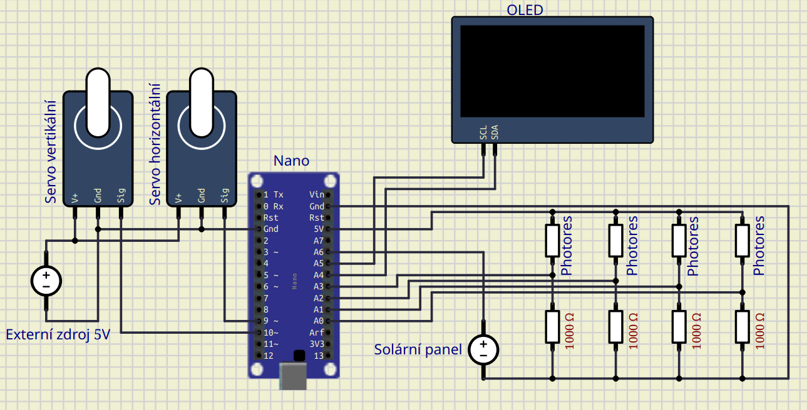
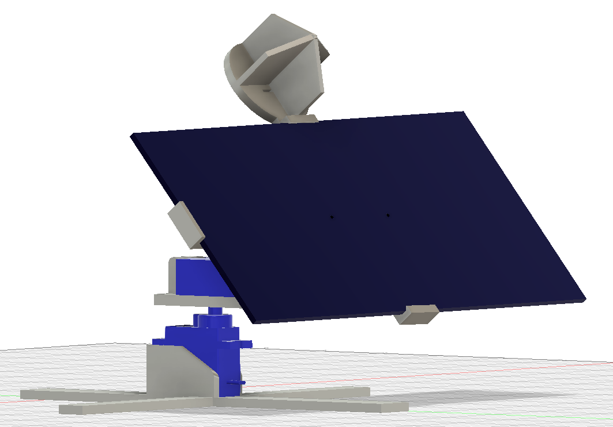
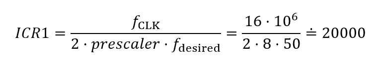
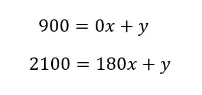

### Členové týmu

- Marek Klvaňa
- Jan Kusák
- David Maňásek

## Popis hardware

Pro projekt bylo využito Arduino Nano kvůli nedostatku pinů pro analogový vstup na desce Arduino UNO. Jako piny pro signálový výstup pro ovládání servo motorů byly využity piny `PB1` pro horizontální natáčení a `PB2` pro vertikální natáčení. Servo motory jsou napájeny z externího zdroje. OLED display byl připojen pomocí I2C sběrnice na piny `PC4` (SDA) a `PC5` (SCL). Pro snímání intenzity světla jsou využiti 4 fotorezistory tvořící čtyři děliče napětí s rezistory 1kΩ. Při zastínění fotorezistoru jeho odpor vzroste. Výstupní napětí těchto děličů jsou připojeny na analogové piny 0 až 3. Výstupní napětí solárního panelu je připojeno na analogový pin 6.

### Držák solárního panelu a fotorezistorů
V programu Fusion 360 byl vytvořen 3D model, který umožňuje zasunutí solárního panelu a zároveň slouží jako držák fotorezistorů s příslušnými přepážkami mezi jednotlivými fotorezistory pro umožnení směrového měření.

## Popis software
### Knihovna `analog`
Umožňuje čtení napětí na analogových pinech. Nejprve je nutné analogově-digitální převodník inicializovat pomocí funkce `analog_init()`. Zde dochází k volbě 5V napájení jako reference, aktivaci A/D převodníku, nastavení kmitočtové předděličky, nastavení spouštění a vypnutí úsporného režimu. Kmitočtovou předděličku je nutné použít, neboť dokumentace [^1] zaručuje v rozmezí 50 kHz až 200 kHz maximální rozlišení a vůbec správnou funkci převodu. Spouštění je realizováno pomocí volně běžícího režimu (free running mode).

Po inicializaci může uživatel číst jednotlivé piny pomocí funkce `analog_read(pin)`. Vstupním parametrem funkce je číslo analogového pinu na desce a výstupem je přečtená 16bitová hodnota napětí. Uvnitř funkce dochází k připojení požadovaného pinu k multiplexu a následnému spuštění konverze nastavením bitu `ADSC` na 1 v registru `ADCSRA`. Následující `while` cyklus využívá výhodné vlastnosti tohoto bitu - při dokončení převodu jej hardware automaticky překlopí na hodnotu 0, takže cyklus zdrží veškerý proces než je konverze dokončena. Naměřená hodnota je pak následně čtena z registrů `ADCL` a `ADCH`, které je nutné číst právě v tomto pořadí [^1]. Jelikož `ADCH` obsahuje dva nejvíce významné bity (MSB) naměřeného napětí, je nutné provést bitový posun o 8 bitů, tedy o velikost registru `ADCL`. 

### Knihovna `servo`
Knihovna poskytuje trojici funkcí obsluhující horizontální a vertikální servo. Každé servo je řízeno vlastní PWM modulací zajištěnou 16bitovým čítačem 1. Kanál horizontálního serva je vyveden na pin PB1, kanál vertikálního serva je na pinu PB2.

*Arduino NANO pinout, převzato z [^2]*

1. `servo_init()` 
Funkce aktivuje neninvertující signály PWM a přiřazuje kanály na vybrané piny. V registru `TCCR1B` je nastaven mód ,,Phase and Frequency Correct PWM" [^1], který je dle [^3] vhodný pro řízení motorů. 

Je nutné přizpůsobit frekvenci pulzů, u kterých budeme měnit střídu. Výrobce serva udává pracovní frekvenci 50 Hz. Strop modulace (čítače) je dána 16bitovým registrem ICR1. Jeho velikost nastavuje frekvenci pulzů [^4] a jemnost kroku PWM modulace (výsledného úhlu natočení serva). Nutnost dodržet kmitočet pulzů stanovený výrobcem serva [^5] bohužel znemožňuje využití plného potenciálu mikrokontroléru, respektive jemnosti kroko, které by bylo možné mít bez využití předděličky (160000 úrovní). Nejbližší nižší hodnota dělení hodinového pulzu je fCLK/8. S jeho použitím pak bude platit následující rovnice pro zisk hodnoty maxima (v dokumentaci uváděno také jako TOP):

$ICR1 = \frac{f_{CLK}}{2 \cdot prescaler \cdot f_{desired}}= \frac{16 \cdot 10^{6}}{2 \cdot 8 \cdot 50}=20000$
Výrobce serva dále udává doby trvání pulzů, které definují úhel natočení serva:
- 0 ° = 0,9 ms,
- 180 ° = 2,1 ms.

Vzájemnou rovností střídy a poměru aktuální nastavené porovnávací hladiny čítače OCR1A (nebo OCR1B pro vertikální servo) vůči ICR1 (stropu) získáme hodnoty pro minimum a maximum rozsahu

Dosazením časů trvání pulzů, periody 1/50 = 20 ms a stropu komparátoru 20000 úrovní získáme komparační úrovně pro rozsah serva

- 0 ° = 900,
- 180 ° = 2100.

Inicializační funkce je zakončena nastavením úhlu natočení na 0 °.

2. `servo_test()`
Funkce zkouší správnost zapojení i softwaru pro ovládání motorů.

3. `turn_servo(bool, uint8_t)`
Parametry je bit horizontal, definující zda chceme ovládat horizontální či vertikální servo, a 8bitový integer nesoucí infomaci o úhlu natočení serva. Úhel je následně vložen do rovnice přímky, jejíž parametry byly vypočítány ze soustavy dvou rovnic převodu krajních úhlů rozsahu na komparační hladiny

Z první rovnice vyplývá konstanta <i>y</i> = 900, zpětným dosazením pak získáme konstantu <i>x</i>=20/3. 

Výsledky transformací jsou pak přiřazování registrům komparačních hladin OCR1A, nebo OCR1B v závislosti, zda je funkce volána pro ovládání horizontálního nebo vertikálního serva. 

### Natáčení za zdrojem světla

Analogové hodnoty získané z napěťových děličů jsou pomocí knihovny analog přečteny a uloženy do proměnných. Sousední hodnoty jsou poté zprůměrovány. Tyto průměry jsou poté odečteny podle jednotlivých směrů. Tímto získáme rozdíly v osvícení mezi levou a pravou stranou a zároveň horní a dolní stranou. Po porvnání těchto odchylek s pevně nastavenou hodnotou poté měníme úhly natočení jednotlivých servo motorů, aby bylo dosaženo natočení za zdrojem světla. Tato funkce se opakuje každých 200ms.

### Zobrazení informací o panelu

Informace o výstupním napětí solárního panelu v mV jsou spolu s úhly natočení ve stupních zobrazeny na OLED displeji. Vertikální úhel zobrazuje hodnotu 0 stupňů v případě natočení panelu rovnoběžně s podstavou. K zobrazení jsou použité funkce z knihovny `oled` využívané ve cvičeních a hodnoty jsou čteny z proměnných. Velikosti proudu a výkonu solárního panelu nejsou zobrazeny z důvodu nedostatečné přesnosti dostupného proudového senzoru. Všechny hodnoty na displeji jsou aktualizovány každou 1s.

## Instructions and photos

Describe how to use the application. Add photos or videos of your application.

## References and tools

1. Put here the references and online tools you used.
2. ...

## Informace z dokumentací součástek
### Seeed Studio 2W Solar Panel 80X180  
- Imax = 360 mA
- Umax = 5,5 V

### Servo Hitec HS-485HB
- Ucc = 4,8 - 8,4 V
- Uin = 3 - 5 V

## Zdroje 
[^1]: https://ww1.microchip.com/downloads/aemDocuments/documents/MCU08/ProductDocuments/DataSheets/Atmel-7810-Automotive-Microcontrollers-ATmega328P_Datasheet.pdf
[^2]: https://www.electronicshub.org/wp-content/smush-webp/2021/01/Arduino-Nano-Pinout.jpg.webp
[^3]: https://avr-guide.github.io/pwm-on-the-atmega328/
[^4]: https://docs.arduino.cc/tutorials/generic/secrets-of-arduino-pwm/
[^5]: https://www.pelikandaniel.com/dld/navod_serva_hitec.pdf
 

