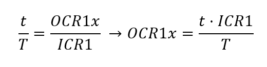

### Team members

- Marek Klvaňa
- Jan Kusák
- David Maňásek

## Hardware description

Describe your implementation and include block or circuit diagram(s).

## Software description

Include flowcharts/state diagrams of your algorithm(s) and direct links to the source files in PlatformIO `src` or `lib` folders. Present the libraries you used in the project.

### Knihovna `servo.h`
Knihovna poskytuje trojici funkcí obsluhující horizontální a vertikální servo. Každé servo je řízeno vlastní PWM modulací zajištěnou 16bitovým čítačem 1. Kanál horizontálního serva je vyveden na pin PB1, kanál vertikálního serva je na pinu PB2.

1. `servo_init()` 
Funkce aktivuje neninvertující signály PWM a přiřazuje kanály na vybrané piny. V registru `TCCR1B` je nastaven mód ,,Phase and Frequency Correct PWM" [^1], který je dle [^2] vhodný pro řízení motorů. 

Je nutné přizpůsobit frekvenci pulzů, u kterých budeme měnit střídu. Výrobce serva udává pracovní frekvenci 50 Hz. Strop modulace (čítače) je dána 16bitovým registrem ICR1. Právě jeho velikost omezuje potencionální jemnost kroku, kterou by bylo možné mít bez využití předděličky (160000 úrovní). Nejbližší nižší hodnota dělení hodinového pulzu je fCLK/8. S jeho použitím pak bude platit následující rovnice pro zisk hodnoty maxima (v dokumentaci uváděno také jako TOP):

Výrobce serva dále udává doby trvání pulzů, které definují úhel natočení serva:
- 0 ° = 0,9 ms,
- 180 ° = 2,1 ms.

Vzájemnou rovností střídy a poměru aktuální nastavené porovnávací hladiny čítače OCR1A (nebo OCR1B pro vertikální servo) vůči ICR1 (stropu) získáme hodnoty pro minimum a maximum rozsahu

Dosazením časů trvání pulzů, periody 1/50 = 20 ms a stropu komparátoru 20000 úrovní získáme komparační úrovně pro rozsah serva

- 0 ° = 900,
- 180 ° = 2100.

Inicializační funkce je zakončena nastavením úhlu natočení na 0 °.

2. `servo_test()`
Funkce zkouší správnost zapojení i softwaru pro ovládání motorů.

3. `turn_servo(bool, uint8_t)`
Parametry je bit horizontal, definující zda chceme ovládat horizontální či vertikální servo, a 8bitový integer nesoucí infomaci o úhlu natočení serva. Úhel je následně vložen do rovnice přímky, jejíž parametry byly vypočítány ze soustavy dvou rovnic převodu krajních úhlů rozsahu na komparační hladiny

Z první rovnice vyplývá konstanta <i>y</i> = 900, zpětným dosazením pak získáme konstantu <i>x</i>=20/3. 

Výsledky transformací jsou pak přiřazování registrům komparačních hladin OCR1A, nebo OCR1B v závislosti, zda je funkce volána pro ovládání horizontálního nebo vertikálního serva. 

## Instructions and photos

Describe how to use the application. Add photos or videos of your application.

## References and tools

1. Put here the references and online tools you used.
2. ...

## Informace z dokumentací součástek
### Seeed Studio 2W Solar Panel 80X180  
- Imax = 360 mA
- Umax = 5,5 V

### Servo Hitec HS-485HB
- Ucc = 4,8 - 8,4 V
- Uin = 3 - 5 V

## Zdroje 
[^1]: https://ww1.microchip.com/downloads/aemDocuments/documents/MCU08/ProductDocuments/DataSheets/Atmel-7810-Automotive-Microcontrollers-ATmega328P_Datasheet.pdf
[^2]: https://avr-guide.github.io/pwm-on-the-atmega328/
[^3]: https://docs.arduino.cc/tutorials/generic/secrets-of-arduino-pwm/
[^4]: https://www.pelikandaniel.com/dld/navod_serva_hitec.pdf

